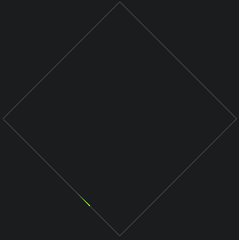

<h1 align="center">comet line</h1>

Page micro motion

The effect picture is as follows



## install

```
yarn add comet-line
```

## usage

Import in project

```js
import Comet from 'comet-line'
```

Generate path by inset `square` function, the param is a two-dimensional array, which represents several points on the path.
Point and point will be connected by a straight line, the frist number is `x` offset, second number is `y` offset。

```js
const path = Comet.square([
  [400, 200],
  [600, 400],
  [400, 600],
  [200, 400],
  [400, 200],
])
```

If you want use custom path, like circle path.you must use `Point` function when creat point.The example is as follows

```js
const path = []
path.push(new Comet.Point(100, 200))
```

After set path:

```js
var canvas = document.getElementById('canvas')
var comet = new Comet(canvas, {
  path: path,
  pathVisible: true,
  pathColor: '#444444',
  cometColor: '#66FF00',
})
comet.play()
```

The first param `canvas` need pass `canvas` element

The second config:

| param       | type    | description                                                             |
| ----------- | ------- | ----------------------------------------------------------------------- |
| path        | Point[] | path                                                           |
| pathColor   | string  | the color of path, default `#444444` |
| pathVisible | boolen  | if true, show path.otherwise, hide |
| cometColor  | string  | the color of comet, default `#66FF00`    |

`comet` instance include two functions:

### play

play animation

### stop

stop animation
